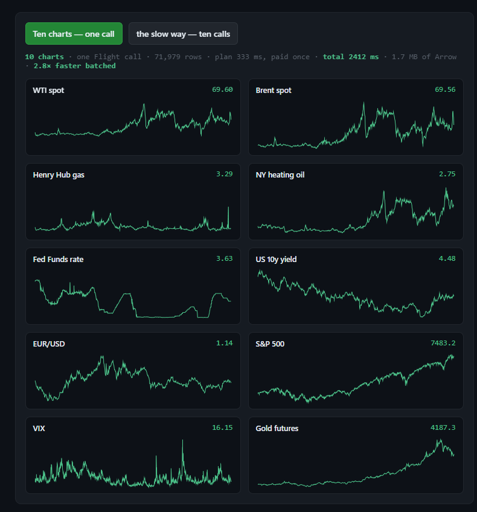

# @sparrowjs/flight

**The missing browser client for Apache Arrow Flight.**

> **Status: M0.** Works today — it powers the [live demo at sparrowflight.io](https://sparrowflight.io/demo/js).
> The API is not yet stable and the package is not yet on npm. Honest scope below.

[](https://sparrowflight.io/demo/js)

*This isn't a mock-up: the screenshot is [a public page](https://sparrowflight.io/demo/js) where your
browser opens an Arrow Flight SQL connection to a 136-million-row production server —
ten full-history series in one call, 71,979 rows in ~2.4 s, no REST, no JSON, no backend.*

## Why

Arrow Flight was designed for high-performance analytics. Browsers were left behind —
they never learned gRPC, so most Flight deployments end up flattening columnar data
into JSON before a chart can touch it.

sparrowJS closes that gap: Flight over **gRPC-web**, decoded by **Apache Arrow's
JavaScript implementation**, streaming record batches directly into the page — no JSON,
zero copies, no REST gateway rewriting your data as text.

It is not tied to any particular server. The same auth + discovery pattern has been
validated against **GizmoSQL (DuckDB)**, **InfluxDB 3 Core**, **Dremio OSS**, and the
EnergyScope production server ([Sparrow](https://sparrowflight.io)).

## The API, as intended

```js
import { FlightClient } from "@sparrowjs/flight";

const client = await FlightClient.connect({
  endpoint: "/flight",
  token,
});

const stream = await client.doGet({ ticket });
for await (const batch of stream) {
  chart.append(batch); // Apache Arrow JS RecordBatch
}
```

What runs today is the M0 factory (`src/demo-entry.js`) — a `createSparrowClient()`
that speaks Flight SQL (`CommandStatementQuery` → `GetFlightInfo` → `DoGet`) and returns
a decoded Arrow table plus wire timings. The `FlightClient` API above is the M1 target.

## How it works

- **Transport** — `@connectrpc/connect-web` (fetch + ReadableStream). Browsers can't
  speak gRPC, so a translation layer sits at the edge: any Envoy with the standard
  `grpc_web` filter (or a Traefik `grpcWeb` middleware) in front of your Flight server.
  The one powering the live demo runs nginx → Envoy `grpc_web` → Flight server.
- **Decode** — `FlightData` frames are reassembled into an Arrow IPC stream
  (continuation marker + padded header + padded body + EOS) and handed to
  `apache-arrow`. Zero copies after decode: columns are typed arrays.
- **Auth** — Basic bootstrap, then **Bearer adoption**: many Flight servers
  (GizmoSQL-style) mint a Bearer from your Basic credentials and bind the session to
  it, so the client adopts the token from the response headers — the same silent trick
  the ADBC drivers do.

## Run it from source

```sh
npm install
npm run gen        # regenerate Flight/FlightSql stubs from the Apache protos (buf)

# M0 proof script — full chain in Node using the *browser* transport:
SPARROW_ENDPOINT=http://your-grpc-web-edge:8890 \
SPARROW_USER=user SPARROW_PASS=pass \
node src/m0.mjs "SELECT 42 AS answer"
```

Bundle for a page (this is exactly how the live demo is built):

```sh
npx esbuild src/demo-entry.js --bundle --minify --format=iife \
  --global-name=SparrowJS --target=es2020 --outfile=sparrow-demo.js
```

## Scope — product work, not research

M0 proved the approach; the pipeline runs in production. What's left:

- [ ] `FlightClient` API polish (connect / doGet / query surface above)
- [ ] multi-batch and dictionary IPC edge cases
- [ ] test coverage
- [ ] npm packaging and publishing

## The Sparrow family

One transport, many clients: [Sparrow](https://sparrowflight.io) (the Flight server) ·
[sparrowXL](https://sparrowflight.io/excel) (Excel) ·
[sparrowCLI](https://sparrowflight.io/cli) (terminal) ·
[sparrowMCP](https://sparrowflight.io/mcp) (AI agents) ·
**sparrowJS** (the browser).

## License

[Apache-2.0](LICENSE)
